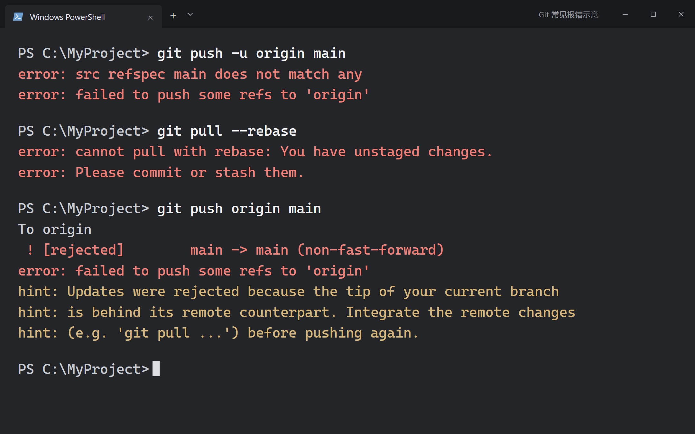
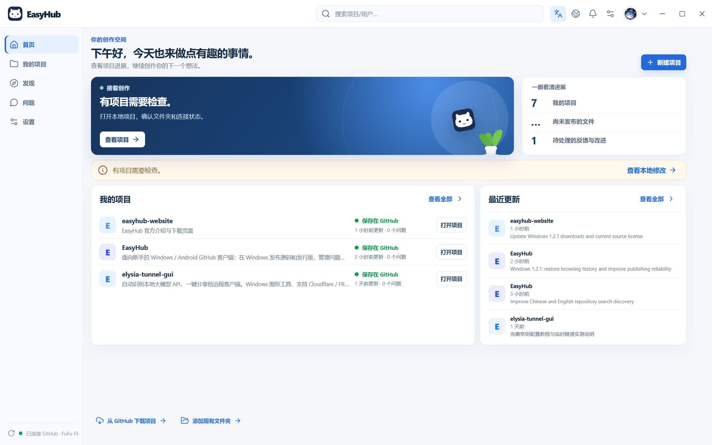

<table>
  <tr>
    <th width="50%">Cryptic command-line errors</th>
    <th width="50%">Publish your work with EasyHub</th>
  </tr>
  <tr>
    <td></td>
    <td></td>
  </tr>
  <tr>
    <td align="center">Illustrative terminal errors</td>
    <td align="center">Actual EasyHub home screen · Click to enlarge</td>
  </tr>
</table>

  

<h1 align="center">EasyHub</h1>

<strong>Make publishing to GitHub as simple as posting an update.</strong>

<a href="README.md">简体中文</a> | <strong>English</strong> · <a href="https://github.com/FuFu-Flash/EasyHub/releases">Download</a> · <a href="https://fufu-flash.github.io/easyhub-website/">Website</a>

**Publish your work to GitHub without learning Git commands.**

EasyHub is an open-source **GitHub client** for beginners. Choose a folder, review your changes, and write a short note to publish your source. Create and publish on Windows; browse projects, reply to issues, and review pull requests on Android.

You do not need to install Git or create a separate EasyHub account. Sign in with your own GitHub account when you are ready to publish.

> **中文简介：** EasyHub 是面向新手的开源 GitHub 客户端，提供 Windows 与 Android 版本，支持发布源码、管理发行版、合并请求审查和可选的 AI 辅助。[阅读中文说明](README.md)。

## Download

**Current versions: Windows 1.2.1 · Android 1.1.0 (ARM64).**

| Platform | Edition | Best for | Download |
| --- | --- | --- | --- |
| Windows | Installer | Regular use, with installation location and desktop shortcut options | **[Download installer](https://github.com/FuFu-Flash/EasyHub/releases/download/v1.2.1/EasyHub-1.2.1-setup.exe)** |
| Windows | Portable | Run directly without installing | **[Download portable](https://github.com/FuFu-Flash/EasyHub/releases/download/v1.2.1/EasyHub-1.2.1-portable.exe)** |
| Android | 1.1.0 ARM64 APK | Most newer Android phones | **[Download Android 1.1.0](https://github.com/FuFu-Flash/EasyHub/releases/download/android-v1.1.0/EasyHub-Android-1.1.0-arm64.apk)** |
| Android | Older 1.0.0 universal APK | For devices unable to install ARM64; excludes the 1.1.0 additions | **[Download universal APK](https://github.com/FuFu-Flash/EasyHub/releases/download/v1.0.0/EasyHub-Android-1.0.0-universal.apk)** |

The Windows editions are for 64-bit PCs. The installer detects a previous installation location and selects “Create desktop shortcut” by default. Android requires Android 7.0 or later. Windows and Android packages are currently available.

## Get started in three steps (Windows)

1. **Sign in to GitHub.** Choose “Sign in with GitHub” in settings and authorize the app in your browser.
2. **Choose a project.** Add an existing local folder, download one of your GitHub repositories, or create a project from a new folder.
3. **Write a note and publish your source.** Review file differences, select the changes to publish, describe what changed, and click “Publish source.” Unselected changes stay on your computer.

Before publishing, EasyHub checks for new content on GitHub. If the same file has changed in both places, it asks which version to keep instead of overwriting it automatically.

- **Publish source** saves everyday changes to your project files on GitHub.
- **Publish a release** gives others a downloadable version with a version number, description, and files such as an installer. Preview it before publishing.

Not ready to sign in? Try the simulated Windows projects. **Simulated actions are not uploaded to GitHub and reset when you restart the app.**

## AI help for reviews and understanding code

When someone proposes changes, open “Pull request review” to read the description and changed files. Use “AI review” for a summary, potential issues, and suggestions. **You decide whether to approve and merge, or reject and close.**

- **Review code changes:** inspect added and removed lines, download changed files, and optionally ask AI what deserves attention.
- **Select code for an explanation:** on Windows, select code in local changes or a pull request and choose “Explain with AI.” The explanation follows the app's language setting.
- **Review program files:** Windows can also inspect files such as EXE and DLL to help explain what a program may do. Ordinary code reviews need no extra components.

AI is optional. Publishing source and managing projects do not require an AI service.

<strong>Set up AI and program file reviews</strong>

Choose OpenAI, DeepSeek, OpenRouter, or SiliconFlow in settings, enter your own API key, and select a model. Once configured, the settings collapse so you can switch models directly.

Before a review, EasyHub identifies the service and content to be sent. It sends the content only after your confirmation and clearly flags private projects. A selected-code explanation sends only the selected code and file name.

Program file reviews require optional components on first use; their download size is shown beforehand. EasyHub reads the file on your computer and extracts parts of its logic, text, and referenced functions. After confirmation, it sends that information to your chosen AI service. You can inspect local files, pull request files, or release attachments.

**The program being reviewed is not executed, and the original program file is not uploaded to the AI service.** Only parts of the file are inspected, so the review cannot guarantee that all issues are found or prove the program is safe.

Your API key is saved in secure storage on the current device and used to connect to your chosen service. Fees and available quotas depend on the provider.

Android 1.1.0 reviews text changes and decompiles program files locally. Download the Java/Dalvik component (about 2.67 MiB) and native component (about 25.14 MiB) separately in settings. They share the [desktop component release](https://github.com/FuFu-Flash/EasyHub/releases/tag/analysis-runtime-ghidra-12.1.2-java-21.0.12.1-r1). Program files downloaded for review are removed when the task finishes or is canceled.

<strong>More Windows features</strong>

**Manage your work**

- Find local folders connected to your own GitHub projects within locations you select, and add them to “My projects.”
- Review added, modified, deleted, and renamed files, then choose which files to publish.
- Edit README content, insert images and links, preview Markdown and common HTML layouts, or write with a live preview. Edits stay local until you publish source.
- Create and edit releases, preview descriptions, and add or remove download attachments. Resume unfinished text later.
- Separate pending counts for issues and pull request reviews, with filters by project, title, or number.
- Inspect changed files and existing build and test results, download files, and decide whether to merge or close a pull request.

**Discover other people's work**

- Search public projects and users or paste a project URL to open it directly. Choose compact or detailed results; clear the last 10 searches at any time.
- Browse daily, weekly, and monthly “EasyHub Popular” projects, with 30 results per page. **This is EasyHub's own ranking, not official GitHub Trending.**
- Browse other people's public projects and download releases or source. Files and settings stay read-only, while you can still ask questions, reply, and propose changes.
- Create a repository fork under your account, download and modify it, publish source, and send a pull request to the original author.
- View user profiles, avatars, contributions, and public projects. README release links open the download page inside EasyHub.

**Translation, downloads, and daily use**

- Use the top translation toggle for public project descriptions, issues, comments, and release notes; toggle again to see the original. Project names, authors, versions, file names, and URLs are preserved where possible; add your own names to preserve.
- View download progress, speed, and remaining time in notifications. Pause, resume, or retry file downloads, then open the file or its folder.
- Go back through browsing history and resume your previous view after switching pages.
- Choose automatic, comfortable, or compact layouts in settings. Check for updates in “About.”
- Enable the system proxy if GitHub connectivity is poor. Existing proxies are reused first; browsers that follow Windows proxy settings can also use it to access GitHub.
- The bell counts unread notifications and clears the count when viewed. New activity and download results notify you again.

<strong>What the Android app can do</strong>

Sign in with GitHub to browse projects, README files, issues, history and releases; create projects, reply to issues and download versions. Public repository and user searches support pagination and direct repository addresses. Profiles show contributions by year and day.

Review pull request files and the build/test checks for their commit, load more replies and reviews, search by title or number, and confirm merging or closing. Star projects, browse starred repositories, create forks and submit existing changes; administrators can manage visibility, archiving, branch protection and other repository settings.

Inspect APK, DEX, JAR, CLASS, EXE, DLL, SO, ELF and Mach-O files on the phone as part of pull request review. Decompilation frameworks are optional downloads in settings and are not bundled in the APK. Analyzed programs are never executed. Your configured AI provider can interpret extracted evidence after confirmation.

Data screens offer pull to refresh with the native blue Android spinner while preserving filters and unsent input. Page transitions animate, and About offers Android update checks. Translate public content on demand and monitor or cancel downloads.

**Android excludes local projects, source editing and publishing, and release publishing and editing.** Create and publish on desktop, then browse and review GitHub content on the phone.

[Parity and build guide](docs/android-parity.md) · [Refresh verification](docs/android-pull-refresh.md) · [Update and motion verification](docs/android-update-and-motion.md)

<strong>Frequently asked questions</strong>

**Can I use it without a GitHub account?**

Try the simulated Windows projects first. Saving to GitHub, replying to other users, or publishing releases requires your own GitHub account.

**Do I have to configure AI?**

No. AI reviews and code explanations are optional and do not affect project management or source publishing.

**Why does Windows show “Unknown publisher”?**

The Windows app does not yet use a commercial code-signing certificate, so this message may appear on first launch. Use download links from this repository's releases or the website.

**Are packages available for other operating systems?**

Windows and Android packages are currently available. There are no official macOS or Linux app packages yet; iOS is not released.

<strong>Data and privacy</strong>

EasyHub requires no separate account and provides no cloud code-hosting service of its own. Project files stay in your selected local folders and on GitHub. Login credentials are saved in secure storage on your current device.

- Translation sends text from public projects to a third-party translation service, excluding private project content. Translations are kept locally, the original remains available, and GitHub content is not modified.
- After confirmation, AI review sends the change title, description, file names, and changed content to your chosen service. Private projects are clearly flagged.
- Program file reviews send file information and extracted content, not the original program files, to the AI service.
- Code explanations send only the selected code and file name.
- AI results are displayed inside the app. They do not automatically change your project, post comments, or merge requests.

## License

EasyHub uses the [Apache License 2.0](LICENSE). Third-party components retain their own licenses; see [Third-party notices](THIRD_PARTY_NOTICES.md).
